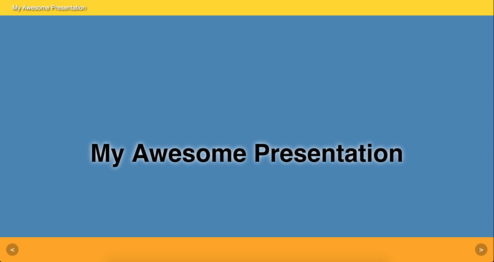
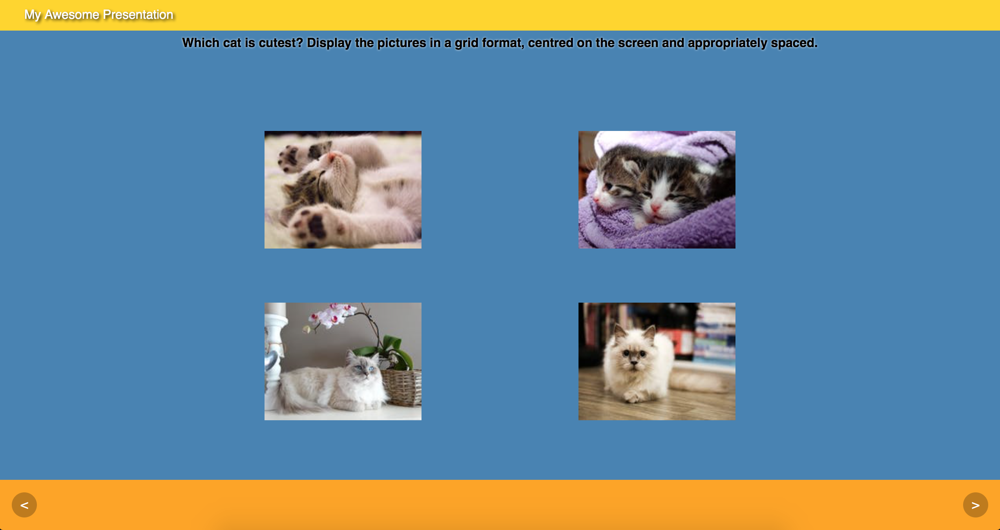
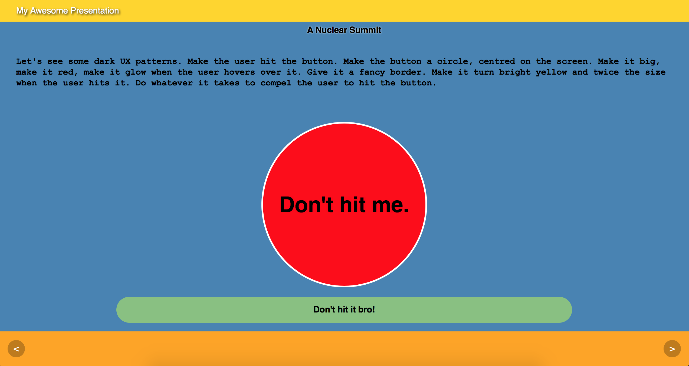
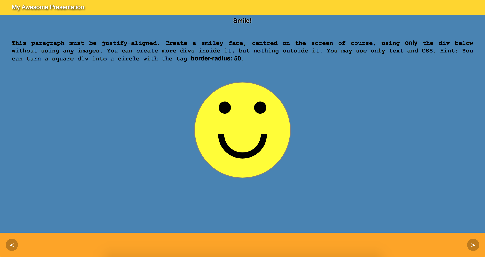

# CSS PowerPoint!

We are going to create an interactive presentation that can be delivered over the internet. Open index.html and examine its contents carefully. It consists of slides, all of which are hidden by default, and two buttons that control which slide is being shown. The JavaScript has been written for you in `script.js` and you will not need to edit that file for this exercise. Only `style.css` and `index.html` should be edited.

## Instructions

Edit `style.css` and `index.html` to reproduce the following slides as closely as possible.

### Slide 1

### Slide 2

### Slide 3
Pay attention to the paragraph describing the behaviour of the button on this slide. Make sure that the button behaves as described when hovered over and clicked upon!

### Slide 4

## Bonus
Make the slides _fade_ from one to another.

## Bonus
Make the slides _slide_ from one to another.